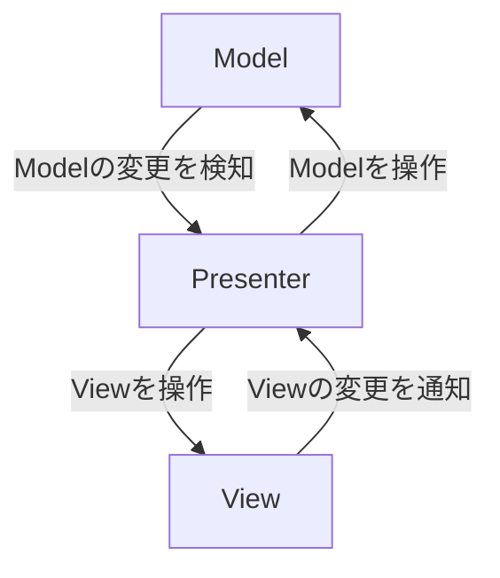

# unity-tutorial-unitask-sample
This is a sample created during the UniTask learning process. for the five free time  
MV(R)Pの学習の一環で作成したプロジェクトです。
# MV(R)Pパターン  
・主にWeb業界で使われているデザインパターン。クライアントが画面(UI)をよく操作することを前提としたデザインパターン。イベント処理が得意なUniRxと相性が良い。  
  
Model:値を管理  
Presenter:ModelとPresenterを繋ぐ  
View:UI全般。アニメーションもここに書く  

# おまけ
### ReactiveCommandをUIに応用してみる 
・ReactiveCommandとは...　**処理が可能であるかを制御する機構**   
・ReactiveCommandでトグルなどがTrueだった場合の処理を簡易化(ここではReactiveCommandのExcuteを用いてトグルと連動し、実行可能な状態かどうなのかを通知)。  

## サンプル
・MV(R)Pパターンを用いたBGM、SEの調整

・ReactiveCommandを用いたBGM、SEのON、OFF    

## 参考
https://www.youtube.com/playlist?list=PLX8FlYCKkO9hbFywFytAFgY4ooGzT6ttv　　
https://www.amazon.co.jp/UniRx-UniTask%E5%AE%8C%E5%85%A8%E7%90%86%E8%A7%A3-%E3%82%88%E3%82%8A%E9%AB%98%E5%BA%A6%E3%81%AAUnity-C-%E3%83%97%E3%83%AD%E3%82%B0%E3%83%A9%E3%83%9F%E3%83%B3%E3%82%B0/dp/4048930753　　
https://github.com/Cysharp/UniTask
